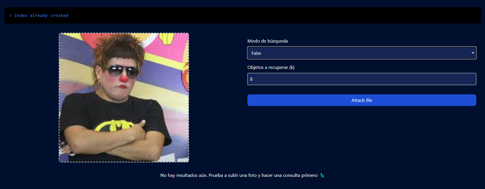
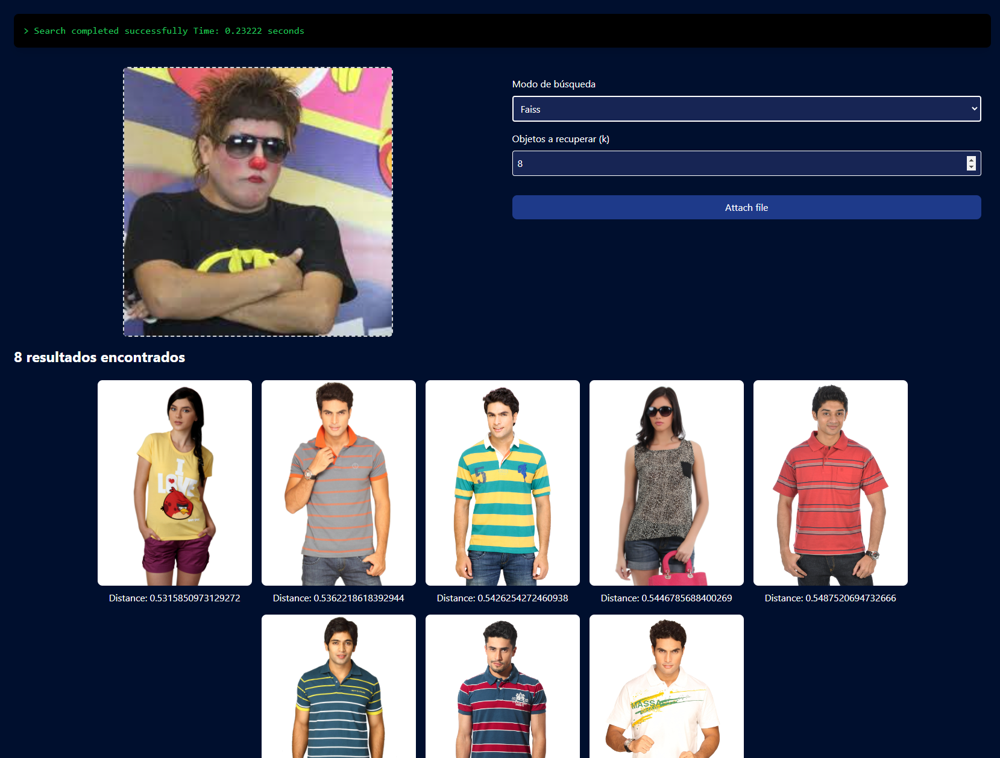
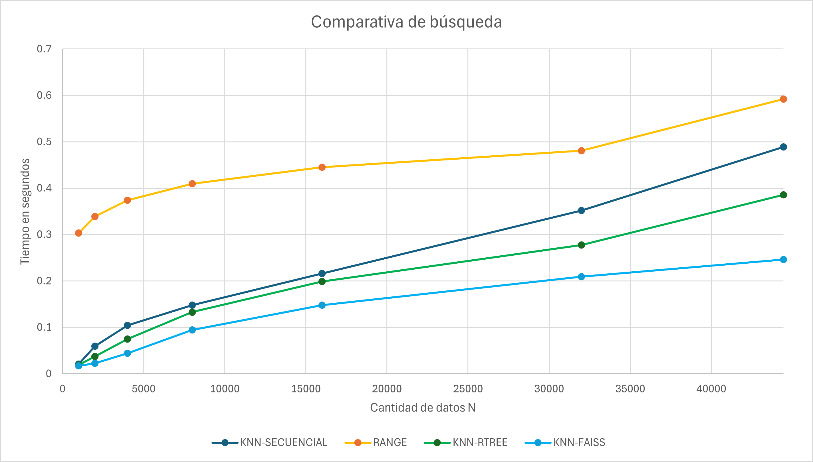

# Proyecto 3 de Base de Datos 2 - Comparación de Métodos de Búsqueda Multidimensional

## Índice

- [Proyecto de Base de Datos 2 - Comparación de Métodos de Búsqueda Multidimensional](#proyecto-de-base-de-datos-2---comparación-de-métodos-de-búsqueda-multidimensional)
  - [Introducción](#introducción)
    - [Objetivo del Proyecto](#objetivo-del-proyecto)
    - [Descripción del Dominio de Datos y la Importancia de Aplicar Indexación](#descripción-del-dominio-de-datos-y-la-importancia-de-aplicar-indexación)
  - [Backend: Índice Multidimensional](#backend-índice-multidimensional)
    - [Técnica de Indexación de las Librerías Utilizadas](#técnica-de-indexación-de-las-librerías-utilizadas)
    - [KNN Search y Range Search](#knn-search-y-range-search)
    - [Análisis de la Maldición de la Dimensionalidad y Cómo Mitigarlo](#análisis-de-la-maldición-de-la-dimensionalidad-y-cómo-mitigarlo)
  - [Frontend](#frontend)
    - [Diseño de la GUI](#diseño-de-la-gui)
    - [Mini-manual de Usuario](#mini-manual-de-usuario)
    - [Screenshots de la GUI](#screenshots-de-la-gui)
    - [Análisis Comparativo Visual con Otras Implementaciones](#análisis-comparativo-visual-con-otras-implementaciones)
  - [Experimentación](#experimentación)
    - [Tablas y Gráficos de los Resultados Experimentales](#tablas-y-gráficos-de-los-resultados-experimentales)
    - [Análisis y Discusión](#análisis-y-discusión)
  - [Ejecución del Proyecto](#ejecución-del-proyecto)
    - [Backend](#backend)
    - [Frontend](#frontend)
  - [Autores](#autores)
  - [Referencias](#referencias)

## Introducción

### Objetivo del Proyecto
El objetivo de este proyecto es comparar la eficiencia de diferentes métodos de búsqueda multidimensional en colecciones de imágenes. Se busca implementar y evaluar la eficiencia de diversos algoritmos de búsqueda como KNN Secuencial, KNN utilizando RTree y KNN utilizando FAISS de Facebook para manejar altas dimensionalidades.

### Descripción del Dominio de Datos y la Importancia de Aplicar Indexación
Para este proyecto, utilizamos el Fashion Product Images Dataset de Kaggle. Este conjunto de datos contiene imágenes de productos de moda, y es crucial aplicar técnicas de indexación eficientes para manejar la gran cantidad de datos y facilitar búsquedas rápidas y precisas. La indexación permite reducir significativamente el tiempo de respuesta en la búsqueda de objetos similares, lo cual es esencial para aplicaciones en tiempo real.

## Backend: Índice Multidimensional

### Técnica de Indexación de las Librerías Utilizadas

1. **KNN-Secuencial**:
    - Implementación de búsqueda sin indexación. Utiliza una cola de prioridad para encontrar los K vecinos más cercanos a un objeto de consulta.
    - Búsqueda por Rango: Encuentra todos los objetos dentro de un radio específico desde el objeto de consulta.

2. **KNN-RTree**:
    - Utiliza un árbol R para indexar los vectores característicos de las imágenes. Sin embargo, debido a la maldición de la dimensionalidad, se aplicó PCA (Análisis de Componentes Principales) para reducir las dimensiones antes de la indexación, ya que el RTree no permitía insertar más de 100 elementos cuando las dimensiones eran superiores a 100.

3. **KNN-HighD (FAISS)**:
    - Utiliza FAISS de Facebook, una biblioteca optimizada para la búsqueda de similitud en grandes colecciones de vectores. FAISS soporta diversas técnicas para mitigar la maldición de la dimensionalidad, incluyendo HNSW (Hierarchical Navigable Small World) y búsquedas en GPU.

### KNN Search y Range Search

- **KNN-Secuencial**:
  ```python
  def knn_secuencial(query, k):
      feature = self.FV.extract_one_feature(query)
      heap = []

      for idx, vector in enumerate(self.vector_features):
          distance = np.linalg.norm(vector - feature)
          if len(heap) < k:
              heapq.heappush(heap, (-distance, self.path_files[idx]))
          else:
              heapq.heappushpop(heap, (-distance, self.path_files[idx]))

      nearest_neighbors = sorted(heap, key=lambda x: x[0], reverse=True)
      return [(path, -dist) for dist, path in nearest_neighbors]
  ```

- **Range Search**:
  ```python
  def range_search(self, query, radius):
      feature = self.FV.extract_one_feature(query)
      results = []

      for idx, vector in enumerate(self.vector_features):
          distance = np.linalg.norm(vector - feature)
          if distance <= radius:
              results.append((self.path_files[idx], distance))

      results = sorted(results, key=lambda x: x[1])
      return results
  ```

- **KNN-RTree**:
  ```python
  def rtree_knn_search(self, query, k):
      feature = self.FV.extract_one_feature(query)
      feature = self.__pca.transform([feature])[0]
      heap = []

      for idx in self.__idx.nearest(feature, num_results=k):
          distance = np.linalg.norm(self.__rtree_vector_features[idx] - feature)
          if len(heap) < k:
              heapq.heappush(heap, (-distance, self.path_files[idx]))
          else:
              heapq.heappushpop(heap, (-distance, self.path_files[idx]))

      nearest_neighbors = sorted(heap, key=lambda x: x[0], reverse=True)
      return [(path, -dist) for dist, path in nearest_neighbors]
  ```

- **KNN-FAISS**:
  ```python
  def faiss_knn_search(self, query, k):
      feature = self.FV.extract_one_feature(query)
      distances, indices = self.__faiss_index.search(np.array([feature]), k)
      return [(self.path_files[idx], dist) for dist, idx in zip(distances[0], indices[0])]
  ```

### Análisis de la Maldición de la Dimensionalidad y Cómo Mitigarlo
La maldición de la dimensionalidad se refiere a varios fenómenos que ocurren cuando se analizan y organizan datos en espacios de alta dimensión. Una de las principales consecuencias es que las distancias entre puntos en alta dimensión tienden a converger, lo que dificulta la diferenciación de vecinos cercanos y lejanos.

Para mitigar este problema:
- **PCA (Análisis de Componentes Principales)**: Se utiliza para reducir la dimensionalidad de los datos antes de indexarlos en RTree. PCA transforma el conjunto de datos original en un conjunto de componentes principales, manteniendo la mayor parte de la variabilidad en menos dimensiones.
- **FAISS**: Emplea algoritmos especializados como HNSW y búsquedas en GPU para manejar eficientemente grandes volúmenes de datos en alta dimensión. HNSW crea una estructura de gráfico jerárquico que permite realizar búsquedas aproximadas muy rápidas.

#### Inception v3 para Extracción de Características
Utilizamos Inception v3, una red neuronal convolucional preentrenada, para la extracción de características de las imágenes. Inception v3 ha demostrado ser extremadamente efectiva para tareas de clasificación de imágenes y extracción de características debido a su arquitectura profunda y eficiente. Al procesar una imagen a través de Inception v3, obtenemos un vector de características de alta dimensión que representa de manera concisa el contenido visual de la imagen.

#### Operaciones en Memoria Secundaria
Todas las operaciones de búsqueda e indexación se realizan en memoria secundaria para manejar eficientemente grandes volúmenes de datos. Esto asegura que el sistema pueda escalar a conjuntos de datos más grandes sin requerir cantidades masivas de memoria RAM, lo que es esencial para aplicaciones del mundo real.

## Frontend

### Diseño de la GUI
La aplicación frontend permite a los usuarios subir una imagen y realizar una búsqueda para encontrar las imágenes más similares en la base de datos. La interfaz muestra los resultados de manera interactiva y permite comparar los resultados obtenidos mediante diferentes métodos de búsqueda.

### Mini-manual de Usuario

1. **Subir una Imagen**: Haga clic en el botón "Upload" y seleccione la imagen que desea utilizar como consulta.
2. **Seleccionar Método de Búsqueda**: Elija entre KNN-Secuencial, KNN-RTree y KNN-FAISS.
3. **Ingresar Parámetro de Búsqueda**: Dependiendo del método seleccionado, ingrese el valor de K (para KNN) o el valor del radio (para Búsqueda por Rango).
4. **Ver Resultados**: Los resultados aparecerán en la pantalla, mostrando las imágenes más similares y el tiempo de ejecución de la búsqueda.

### Screenshots de la GUI

#### Subir Imagen y Seleccionar Método


#### Ingresar Parámetro de Búsqueda


#### Resultados de Búsqueda


### Análisis Comparativo Visual con Otras Implementaciones
Se comparan visualmente los resultados obtenidos mediante los diferentes métodos de búsqueda para observar la eficiencia y precisión de cada uno en encontrar los objetos más similares.

## Experimentación

### Tablas y Gráficos de los Resultados Experimentales
Se realizaron pruebas con diferentes tamaños de cole

cciones de objetos (N = 1000, 2000, 4000, 8000, 16000, 32000, 44441) manteniendo el valor de K=8. A continuación se muestran los resultados en términos de tiempo de ejecución para cada método de búsqueda:

| N     | KNN-SECUENCIAL | RANGE   | KNN-RTREE | KNN-FAISS |
|-------|----------------|---------|-----------|-----------|
| 1000  | 0.021          | 0.30334 | 0.01868   | 0.01703   |
| 2000  | 0.05934        | 0.33880 | 0.03735   | 0.02237   |
| 4000  | 0.10401        | 0.37427 | 0.07474   | 0.04398   |
| 8000  | 0.14801        | 0.40973 | 0.13282   | 0.09462   |
| 16000 | 0.21601        | 0.44519 | 0.19882   | 0.14809   |
| 32000 | 0.35202        | 0.48066 | 0.27764   | 0.20943   |
| 44441 | 0.48905        | 0.59234 | 0.38544   | 0.24593   |

### Análisis y Discusión
De los resultados se observa que:
- **KNN-FAISS** es consistentemente más rápido que los otros métodos, especialmente a medida que el tamaño de la colección de datos aumenta.
- **KNN-RTree** también muestra un buen rendimiento, aunque no tan eficiente como FAISS, especialmente en altas dimensionalidades.
- **KNN-Secuencial** es el método menos eficiente, mostrando tiempos de ejecución significativamente mayores para grandes colecciones de datos.
- **Range Search** tiene un comportamiento variable y menos eficiente en comparación con KNN-FAISS y KNN-RTree.

En conclusión, FAISS es la mejor opción para búsquedas en colecciones de datos de alta dimensionalidad debido a su capacidad para manejar eficientemente grandes volúmenes de datos y mitigar los efectos de la maldición de la dimensionalidad.



## Ejecución del Proyecto

### Backend
Para ejecutar el servidor backend, debe crear un entorno virtual e instalar las dependencias desde el archivo `requirements.txt`. Luego, ejecute el servidor con el siguiente comando:

```bash
cd backend
python3 -m venv venv
source venv/bin/activate
pip install -r requirements.txt
uvicorn main:app --reload
```

### Frontend
Para ejecutar el servidor frontend, debe instalar los módulos de Node.js y luego ejecutar el servidor con el siguiente comando:

```bash
cd frontend
npm install
npm run dev
```

### Despliegue en AWS
Todo el sistema está desplegado en AWS y se puede acceder a través del siguiente enlace: [http://image-simulator.s3-website-us-east-1.amazonaws.com/](http://image-simulator.s3-website-us-east-1.amazonaws.com/)

## Autores

| **Benjamin Soto** | **Edgar Chambilla** | **Fabrizzio Vilchez** | **Ian Gonzales** | **Jeffrey Monja** |
|:------------:|:------------:|:------------:|:------------:|:------------:|
|  |  |  |  |  |
| [https://github.com/SotoBenjamin](https://github.com/SotoBenjamin) | [https://github.com/Edgar5377](https://github.com/Edgar5377) | [https://github.com/Fabrizzio20k](https://github.com/Fabrizzio20k) | [https://github.com/mukanjy0](https://github.com/mukanjy0) | [https://github.com/jeffreymonjacastro](https://github.com/jeffreymonjacastro) |

## Referencias

- Johnson, J., Douze, M., & Jégou, H. (2017). Billion-scale similarity search with GPUs. *arXiv preprint arXiv:1702.08734*. Recuperado de https://arxiv.org/abs/1702.08734
- Szegedy, C., Vanhoucke, V., Ioffe, S., Shlens, J., & Wojna, Z. (2016). Rethinking the Inception Architecture for Computer Vision. *Proceedings of the IEEE Conference on Computer Vision and Pattern Recognition (CVPR)*, 2016, 2818-2826. doi:10.1109/CVPR.2016.308
- Kaggle. (n.d.). Fashion Product Images Dataset. Recuperado de https://www.kaggle.com/paramaggarwal/fashion-product-images-dataset
- Guttman, A. (1984). R-trees: A dynamic index structure for spatial searching. *Proceedings of the 1984 ACM SIGMOD International Conference on Management of Data*, 47-57. doi:10.1145/602259.602266